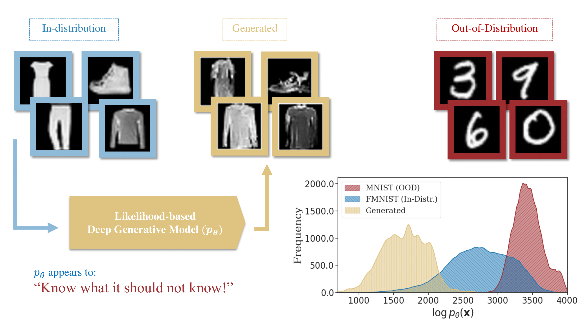

# OOD Detection for Likelihood-based Deep Generative Models

<p align="center">
  
</p>

Intuitively, when one trains a likelihood-based model, it increases the likelihood for the training (in-distribution), one might also reasonably assume that since the likelihoods integrate to zero (they are a valid density) they would obtain low likelihoods on out-of-distribution. Paradoxically, based on the research presented in ["Do deep generative models know what they don't know?"](https://arxiv.org/abs/1810.09136), likelihood values alone are not a reliable indicator for whether a datapoint is OOD or not, and in many cases, the out-of-distribution data *consistently* get assigned higher likelihoods.
On the flip side, these generative models are capable of generating high-quality in-distribution data. Thus, the clues for OOD detection likely exist within these models, even if they aren't directly tied to the likelihood values.
To unravel this, our exploration encompasses the complete likelihood landscape or their learned density. Through this, we aim to elucidate these complexities and enhance approaches for OOD detection.

**Note**: This codebase is based on the generative models in [two_step_zoo](https://github.com/layer6ai/two_step_zoo), containing code from the paper ["Diagnosing and Fixing Manifold Overfitting in Deep Generative Models"](https://arxiv.org/abs/2204.07172) accepted to TMLR in July 2022. Here, the models hyperparameters are tailored for this particular application.

## Setup

**Make sure that your Python is `3.9` or higher; otherwise, some of the new autodiff functionalities we use might break. Also, you should install the nflows package from [here](https://github.com/HamidrezaKmK/nflows) which is a version of `nflows` that makes it functional for RQ-NSFs. All of these are automatically handled in the environment files.**

In terms of Python environments, we support both `pip` and `conda`.

To install the requirements with `pip` run the following:

```bash
pip install -r requirements.txt
```

As for `conda`, you may run the following:

```bash
conda env create -f env.yml 
# This creates an environment called 'ood-detection' that you can activate
```

## Custom Environment Variables

We have optionally introduced dynamic directory allocation. 
You have the option to specify environment variables for directories where checkpoints or datasets are stored. If not set, the code will default to creating a `runs` directory for model checkpoints and a `data` directory for dataset details.

```bash
# Set the directory where you store all the model checkpoints
dotenv set MODEL_DIR <root-path-to-model-configurations-and-weights>
# Set the directory where you store all the datasets
dotenv set DATA_DIR <root-path-to-data-directory>
```

## Running Single Experiments

The project is divided into two sections:

1. **Training likelihood-based models**: 
The codes for model training lie within the [model_zoo](./model_zoo/) directory. To run a specific model, define a training configuration and run `train.py` on that configuration. For example, to train a Neural Spline Flow on Fashion-MNIST, there is a training configuration defined at [train_config](configurations/training/example_train.yaml). We use `jsonargparse` to define all your configurations in a `yaml` file, so you can run the following:

```bash
python train.py --config configurations/training/example_train.yaml 
# please refer to setting up weights and biases if you ran into related errors here
```

2. **Performing OOD-detection**: The codebase for OOD-detection lies within the [ood](./ood/) directory. Every OOD detection method is encapsulated within a class that inherits a base class defined in [OODMethodBaseClass](./ood/base_method.py). To run experiments on OOD detection, one can pick any likelihood-based model with specific checkpoints, specify an *in-distribution* dataset and an *out-of-distribution* dataset, and run the method. The `main_ood.py` is the runner script for this. Similar to the training configurations, we use `jsonargparse` to define all your configurations in a `yaml` file, so you can run the following example that performs a basic OOD detection technique on a Neural Spline Flow trained on Fashion-MNIST and then tests it on MNIST to see the pathology:

```bash
python main_ood.py --config configurations/ood/simple_rq_nsf_fmnist_mnist.yaml
```

For more information on how to define these configurations, please check out our [guide](./docs/configs.md) alongside the comments in the `yaml` files that we have provided.

## Weights and Biases Integration and Sweeps

We use [dysweep](https://github.com/HamidrezaKmK/dysweep), which is an integration with weights and biases for systematic experimentation (similar to [Hydra](https://hydra.cc/) but specific to Weights & Biases). 
We have grouped our experiments into different `yaml` files containing all the hyperparameter setup necessary down to the detail. Each file contains an overview of a **group** of relevant experiments; this integration groups together our experiments and performs sweeps that allow for parallelism. For an overview of our grouped experiments, please refer to the directory [meta configuration](./meta_configurations/).

### Setting up Weights and Biases

To run the experiments, we require you to create a Weights & Biases workplace and set up the login information according to the guidelines indicated [here](https://docs.wandb.ai/quickstart).

**Important note:** The current workspace in all the `yaml` files is set to `platypus-dgm` in [meta configuration](./meta_configurations/), please change it to whatever workspace or entity you are working with.

### Running Sweeps

Weights & Biases creates sweep servers that help you to simultaneously run different experiments.
Every `yaml` file in [meta configuration](./meta_configurations/) contains information in a sweep that can be run using the following:
```bash
dysweep_create --config <path-to-meta-configuration>
```
For example, to run a sweep server that handles training all the greyscale images, you may run the following:
```bash
dysweep_create --config ./meta_configuration/training/grayscale_flows.yaml
```
After running each sweep, you will be given a sweep identifier from the sweep server which would in turn allow you to run the actual experiments in parallel. To initiate a process that takes an experiment from the sweep server and run it, you may run the following:
```bash
./meta_run_train.sh <sweep-id> # if the sweep is pertaining to a model training task
./meta_run_ood.sh <sweep-id> # if the sweep is pertaining to an OOD detection task
```

## Reproducing work based on this codebase

* For the local intrinsic dimension (LID) based method, please check [here](docs/reproduce_lid.md).
* For benchmarks on the LID estimation method that we employ, please check [here](docs/lid_estimation_comparison.md).